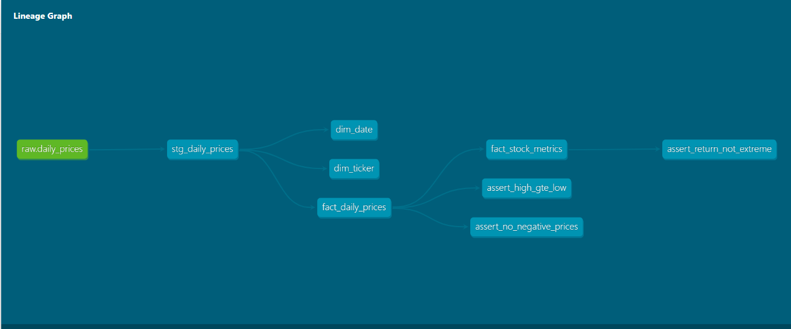

# Market Data ELT Pipeline

Extracts daily OHLCV price data for a small equity/ETF basket (AAPL, MSFT,
GOOGL, JPM, GS, SPY), orchestrates ingestion with Airflow running in Docker,
lands raw data in Snowflake, and transforms it into an analytics-ready model
computing daily returns, rolling volatility, and moving averages.

## Architecture

Alpha Vantage API → Python extraction script → Airflow (Docker) →
Snowflake (raw) → dbt (staging → marts) → dbt tests → dbt docs

## Stack

- **Extraction**: Python (`requests`), rate-limit aware (Alpha Vantage free tier)
- **Orchestration**: Apache Airflow, running in Docker, scheduled after
  US market close on weekdays
- **Warehouse**: Snowflake
- **Transformation**: dbt — staging models + a star schema (dim_ticker,
  dim_date, fact_daily_prices) + a derived analytics mart (fact_stock_metrics)
- **Testing**: dbt tests — not_null, unique, relationships, plus custom
  domain checks (high >= low, no negative prices, extreme single-day
  return flagging)

## What this demonstrates

- ELT pattern: raw data lands untransformed, all transformation logic
  lives in version-controlled dbt SQL
- Idempotent, retry-aware orchestration (Airflow retries, rate-limit handling)
- Dimensional modeling (fact/dimension tables)
- Data quality testing as part of the pipeline, not bolted on after
- Documented lineage via dbt docs

## How to run it

1. Set up a `.env` file with Alpha Vantage and Snowflake credentials
2. `python scripts/extract_load.py` — test extraction manually
3. `docker compose up -d` (from the Airflow project folder) — start orchestration
4. Trigger `market_data_pipeline` DAG from the Airflow UI at localhost:8080
5. `cd dbt_market && dbt run && dbt test` — build and validate the models
6. `dbt docs generate && dbt docs serve` — view the lineage graph

## Sample output

[Add your dbt docs lineage graph screenshot here]
[Add a screenshot of a query against fact_stock_metrics here]

